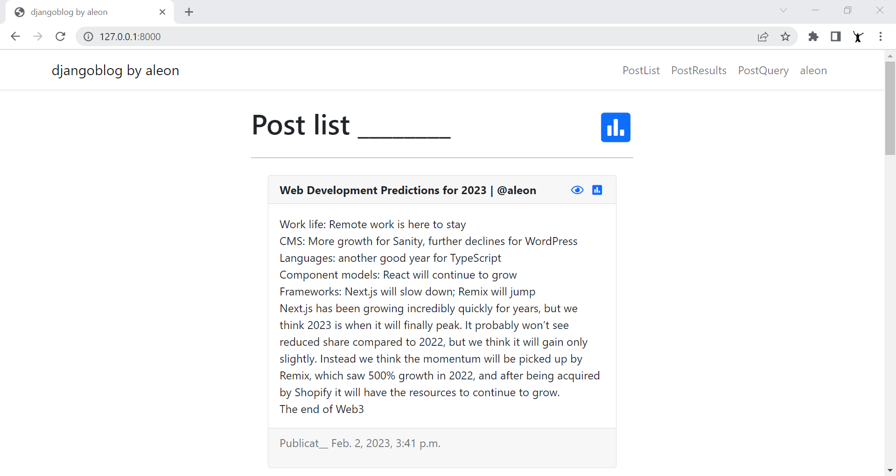
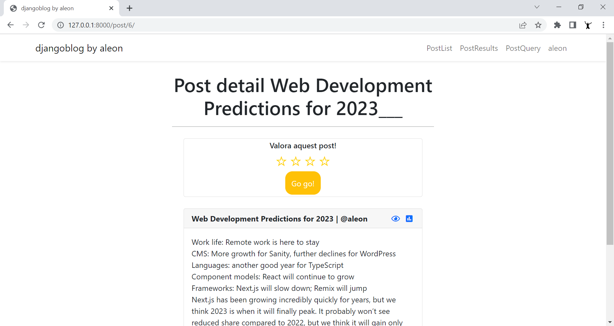
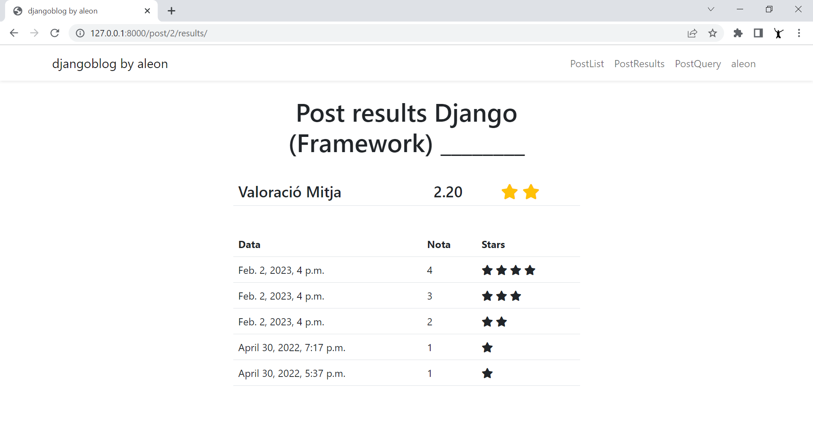
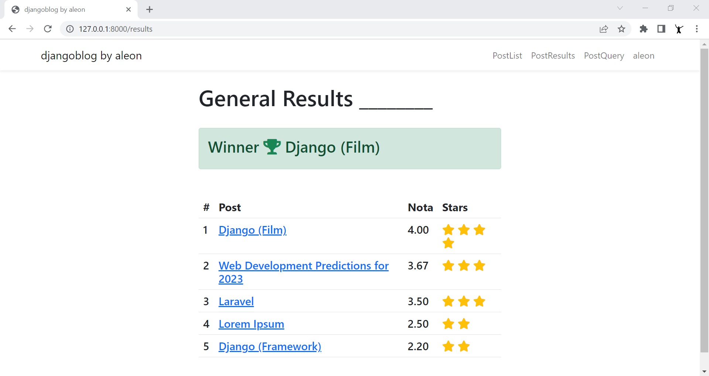
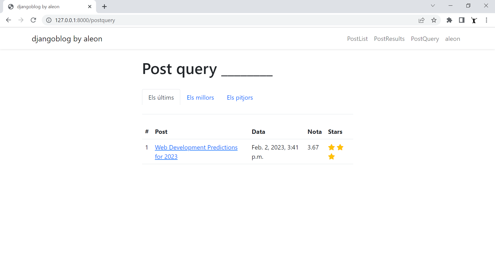
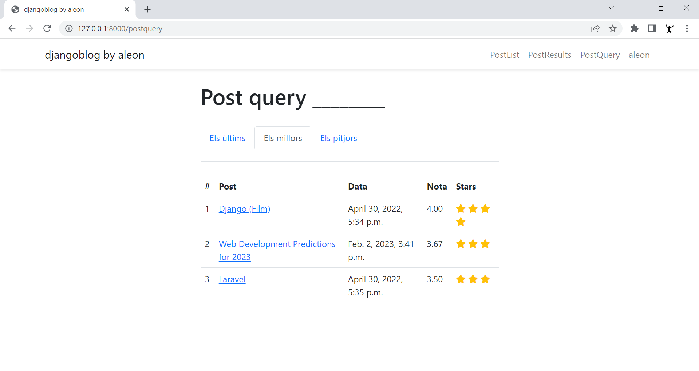
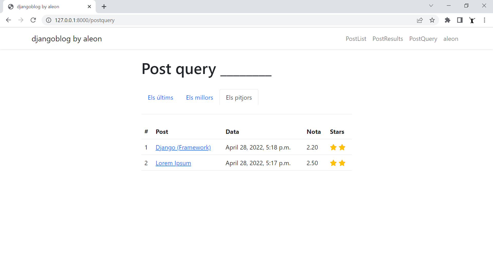

# djangoblog

A Django App example with MySQL.
Use of Migrations, Forms, Views, Models, Templates and Bootstrap 5.

## Getting Started

To run the demo locally, clone the repository and move into it:
- git clone git@github.com:aleongit/djangoblog.git
- cd djangoblog

## Requeriments
- python >= 3.8
- MySQL >= 8

## Install dependencies:
- pip install Django (v4)
- pip install mysqlclient

## DB
- create db and user djangoblog
- configure db parameters in djangoblog\settings.py

## Run
- cd djangoblog
- python manage.py runserver
- Open your browser and go to http://127.0.0.1:8000/

